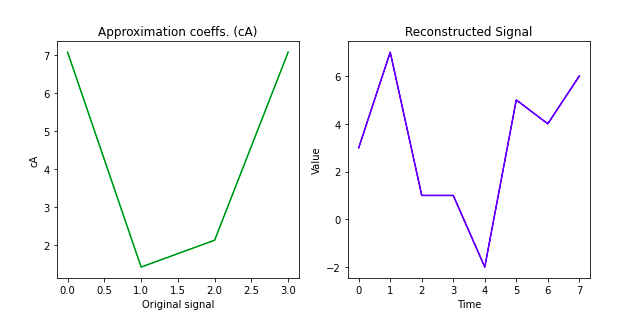

# Wavelet_Transform
A discrete wavelet transform (DWT) is a transform that decomposes a given signal into a number of sets, where each set is a time series of coefficients describing the time evolution of the signal in the corresponding frequency band.  Various techniques were proposed like Subband coding, pyramidal coding. Discrete wavelet transforms can be used for image processing. As the resolution of the image increases, it requires a lot of disk space. DWT is used to reduce the size of an image without compromising on quality and hence resolution increases   

## Single Level Discrete Wavelet Transform and Inverse Transform :  
[ cA , cD ] = dwt( x , wname ) , returns the single-level discrete wavelet transform (DWT) of the vector x using the wavelet specified by wname . The wavelet must be recognized by wavemngr . dwt returns the approximation coefficients vector cA and detail coefficients vector cD of the DWT.

## Multi-Level Discrete Wavelet Transform and Inverse Transform : 

Here the we used, coeffs = pywt.wavedec(x,’wavelet’,mode= ‘sym’,level =n)

Where, [cA(n), cD(c),cD(n-1),.....,cD2,cD1] = coeffs.

When level = 3 , means there will be 3  decompositions of the signal. x is the input and wavelet is the decomposition that we want to use. Mode here is by default symmetric. It can be periodic, etc.

y= pywt.waverec(coeffs,’wavelet’,mode = ‘sym’) , here this is used for inverse wavelength transform. 

| Single Level transform       | Multi-level Transform       |
|------------|-------------|
| | |
